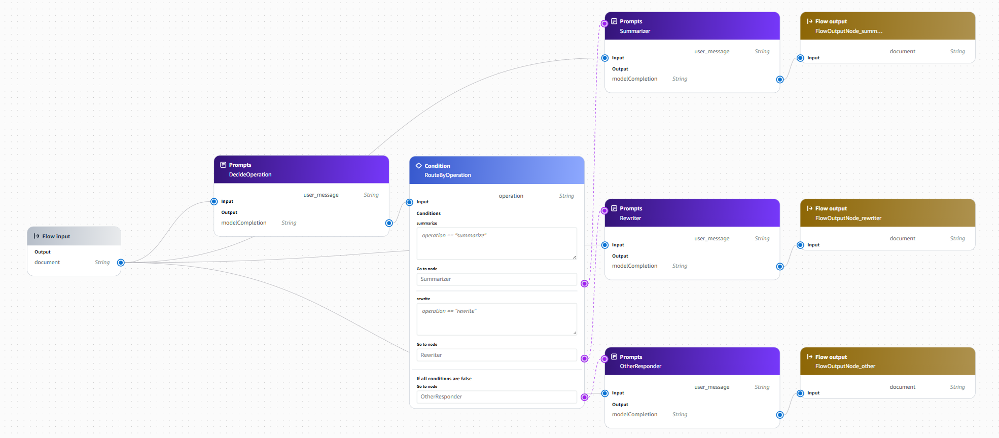

# Exercise – Text Helper Flow

## Overview

You are adding a "Text Helper" feature to an internal wiki tool. Users paste a message that includes what they want to do and the text to process. Your task is to build a Bedrock Flow that detects the requested operation and runs the correct prompt.

---

## What You Will Build

```
Flow Input (user_message)
    │
    ▼
[Node 1: DecideOperation]  →  outputs "summarize", "rewrite", or "other"
    │
    ▼
[Condition: RouteByOperation]
    ├── operation == "summarize"  →  [Node 2A: Summarizer]      →  Flow Output
    ├── operation == "rewrite"    →  [Node 2B: Rewriter]        →  Flow Output
    └── else                      →  [Node 2C: OtherResponder]  →  Flow Output
```

---

## Task 1 – Create the Flow

1. Open the [Amazon Bedrock console](https://console.aws.amazon.com/bedrock) and navigate to **Flows**
2. Click **Create flow** and name it `text-helper`

---

## Task 2 – Configure the Flow Input

The flow takes a single input:

- `user_message` (String) — the user's full message, which includes their request and the text they want processed

Configure the **Flow input** node to expose this single field.

---

## Task 3 – Add Node 1: DecideOperation

Create a prompt node named `DecideOperation`.

This node reads the user's message and outputs exactly one word: `summarize`, `rewrite`, or `other`.

**Your task:** Write a prompt template that:

- Instructs the model to output only the single word — no explanation, no punctuation
- Maps `summarize` to requests about condensing, shortening, or summarizing
- Maps `rewrite` to requests about clarity, improving readability, or rephrasing
- Outputs `other` for messages that don't appear to be a text processing request at all

> **TODO:** Write the prompt template for this node.

```
You are a text processing classification model. Your task is to analyze the user's input message and classify it into exactly one of three category keywords:

- summarize: The user explicitly or implicitly asks to condense, shorten, extract key points from, or summarize text.
- rewrite: The user asks to rephrase, improve readability, edit, polish, revise, reword, or adjust the tone or clarity of existing text.
- other: The message is a general query, a question, a coding request, conversational chatter, or does not involve summarizing or rewriting text.

Output Rules:
1. Output EXACTLY one single word from the three options: summarize, rewrite, or other.
2. Do NOT include any explanations, reasoning, punctuation, spaces, quotes, or additional text.

User message:
{{user_message}}
```

Input variable: `user_message` (String)

---

## Task 4 – Add the Condition Node

Create a condition node named `RouteByOperation`.

- **Condition 1:** `operation == "summarize"` → routes to Summarizer
- **Condition 2:** `operation == "rewrite"` → routes to Rewriter
- **Default (else):** routes to OtherResponder

Wire the output of `DecideOperation` to the condition input named `operation`.

---

## Task 5 – Add Node 2A: Summarizer

Create a prompt node named `Summarizer`.

This node receives the full `user_message` and produces:

- A 5-bullet summary of the main points from the text in the message
- A one-sentence TL;DR at the end

> **TODO:** Write the prompt template for this node.

```
You are a text processing assistant. Your task is to analyze the user's message and generate a structured summary based on its contents.

Instructions:
1. Provide a 5-bullet point summary of the main points from the provided message.
2. End the response with a one-sentence TL;DR summarizing the core message.
3. Do not include any introductory setup text before the bullet points.

User message:
{{user_message}}
```

Input variable: `user_message` (String)

---

## Task 6 – Add Node 2B: Rewriter

Create a prompt node named `Rewriter`.

This node receives the full `user_message` and produces a clearer rewrite of the text in the message that:

- Preserves the original meaning
- Improves readability without changing the author's intent
- Does not add information that was not in the original

> **TODO:** Write the prompt template for this node.

```
You are an expert editor and text refinement assistant. Your task is to rewrite the provided user message to make it clearer and more readable.

Instructions:
1. Preserve the original meaning and author's intent precisely.
2. Improve clarity, flow, and readability.
3. Do not add any new information, facts, or context that was not present in the original text.
4. Output only the rewritten text without introductory or concluding remarks.

User message:
{{user_message}}
```

Input variable: `user_message` (String)

---

## Task 7 – Add Node 2C: OtherResponder

Create a prompt node named `OtherResponder`.

This node handles messages that don't clearly request a summarize or rewrite operation. It should:

- Acknowledge the message politely
- Not attempt to process any text
- Ask the user to clarify whether they want to summarize or rewrite

> **TODO:** Write the prompt template for this node.

```
You are a helpful text processing assistant. The user's message does not explicitly request a summarize or rewrite task.

Instructions:
1. Politely acknowledge the user's message.
2. Do not attempt to process, analyze, or answer any embedded questions or text within the message.
3. Ask the user to clarify whether they would like you to summarize or rewrite their text.

User message:
{{user_message}}
```

Input variable: `user_message` (String)

---

## Task 8 – Wire the Connections

Connect the nodes as follows:

| From                     | To               | What to map                     |
| ------------------------ | ---------------- | ------------------------------- |
| Flow input               | DecideOperation  | `user_message` → `user_message` |
| DecideOperation (output) | RouteByOperation | model response → `operation`    |
| Flow input               | Summarizer       | `user_message` → `user_message` |
| Flow input               | Rewriter         | `user_message` → `user_message` |
| Flow input               | OtherResponder   | `user_message` → `user_message` |
| Summarizer (output)      | Flow output      | model response → output         |
| Rewriter (output)        | Flow output      | model response → output         |
| OtherResponder (output)  | Flow output      | model response → output         |



---

## Task 9 – Prepare and Test

Click **Prepare**, wait for the status to reach **Prepared**, then test with the cases below.

### Test Case 1 – Summarize request

```
Can you give me a quick summary of this?

Remote work has fundamentally changed how companies think about office space, talent acquisition, and team culture. Companies that once required all employees to be physically present have adopted hybrid models, where employees split time between home and the office. This shift has created new challenges around collaboration, onboarding, and maintaining a sense of belonging for remote employees. At the same time, it has opened up talent pools previously limited by geography — companies can now hire engineers in cities where they don't have offices. However, managing distributed teams requires new skills from managers, including asynchronous communication, outcome-based performance reviews, and deliberate efforts to build culture across time zones.
```

Expected: `DecideOperation` outputs `summarize` → `Summarizer` runs

---

### Test Case 2 – Rewrite request

```
This is hard to read. Can you make it clearer?

The utilization of asynchronous communication methodologies in distributed organizational structures has demonstrated significant potential in facilitating improved collaboration outcomes, notwithstanding the inherent challenges associated with temporal displacement among geographically disparate team members who are required to maintain operational coherence in the absence of synchronous interaction opportunities.
```

Expected: `DecideOperation` outputs `rewrite` → `Rewriter` runs

---

### Test Case 3 – Other (no clear operation)

```
Hey, can you help me with something?
```

Expected: `DecideOperation` outputs `other` → `OtherResponder` runs

---

## Deliverable

- Screenshots of the completed flow and all node configurations
- The prompts you wrote for each of the four prompt nodes
- The output produced for Test Cases 1, 2, and 3
